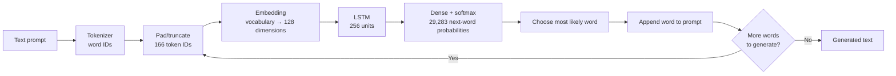
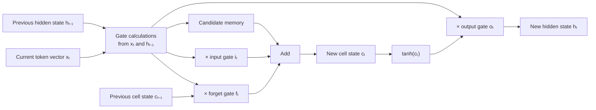

# Next-Word Prediction with LSTM

An LSTM language-model project that predicts the next word in a text sequence. A trained model and its matching tokenizer are loaded by a Streamlit app, where you provide a prompt and choose how many words to generate.

## Contents

- [How it works](#how-it-works)
- [LSTM architecture](#lstm-architecture)
- [Repository files](#repository-files)
- [Run the app](#run-the-app)
- [Training workflow](#training-workflow)
- [Notes and limitations](#notes-and-limitations)

## How it works

The project turns text into integer token IDs, trains a neural network to predict the next token, and repeatedly feeds each prediction back into the model to generate a continuation.

At inference time, the Streamlit app:

1. Loads `Next_word_pred.h5` and `tokenizer.pkl`.
2. Converts the user's prompt into token IDs with the saved tokenizer.
3. Keeps the most recent 166 tokens and pre-pads shorter sequences with zeros.
4. Predicts a probability for each word in the model's vocabulary.
5. Selects the most likely word and appends it to the prompt.
6. Repeats this process for the requested number of words.

## LSTM architecture

The architecture below matches the model summary in the training notebook.



### What each layer does

| Layer | Output shape (excluding batch) | Purpose |
| --- | --- | --- |
| Input | `166` token IDs | Provides a fixed-length context window. |
| Embedding (`128` dimensions) | `166 × 128` | Maps each token ID to a trainable dense vector that the model can use to represent word relationships. |
| LSTM (`256` units) | `256` | Reads the embedded sequence in order and summarizes context into a hidden representation. |
| Dense (`29,283` units, softmax) | `29,283` probabilities | Scores every vocabulary token as the possible next word. |

The notebook reports **11,668,195 trainable parameters** in total.

### LSTM cell intuition

An LSTM processes one time step (one token vector) at a time. Its gates help it preserve useful context and discard less useful information:



- **Forget gate:** chooses which information to remove from the previous cell state.
- **Input gate:** chooses which new information to write to the cell state.
- **Cell state:** carries longer-term information through the sequence.
- **Output gate:** determines the hidden state passed to the next time step and, at the end of the sequence, to the Dense layer.

The output softmax represents a probability distribution over the vocabulary. The app currently uses **greedy decoding**: it always selects the highest-probability word. It does not sample alternatives.

## Repository files

| File | Description |
| --- | --- |
| `app.py` | Streamlit interface and iterative next-word generation. |
| `Next_word_pred.h5` | Saved Keras model. This large file is tracked with Git LFS. |
| `tokenizer.pkl` | Tokenizer fitted during training; required to map text to the model's token IDs. |
| `Project-main.ipynb` | Main notebook containing data preparation, training, and model inspection. |
| `Project_colab.ipynb` | Notebook for running the workflow in Google Colab. |
| `News_Category_Dataset_v3.json` | Local training data file; it is not included in this repository. |
| `data.csv` | Local data/export file; it is not included in this repository. |

The saved tokenizer and model must come from the same training run. Replacing one without the other can produce incorrect token mappings or invalid predictions.

## Run the app

### Requirements

- Python 3.12 is the version used to verify the app in this project environment.
- Git LFS is needed when cloning the repository so Git can download the model file.

### 1. Clone the repository

Install [Git LFS](https://git-lfs.com/) if it is not already installed, then run:

```powershell
git lfs install
git clone https://github.com/erharsh2104/LSTM-Next-Word-Predictor.git
cd LSTM-Next-Word-Predictor
```

### 2. Create and activate a virtual environment

```powershell
py -3.12 -m venv .venv
.\.venv\Scripts\Activate.ps1
```

If PowerShell blocks environment activation, use Command Prompt instead:

```bat
.venv\Scripts\activate.bat
```

### 3. Install dependencies

```powershell
python -m pip install --upgrade pip
python -m pip install streamlit tensorflow numpy
```

### 4. Start Streamlit

Run this command from the project directory, where `app.py`, `Next_word_pred.h5`, and `tokenizer.pkl` are located:

```powershell
python -m streamlit run app.py
```

Streamlit prints a local URL (usually `http://localhost:8501`) that you can open in your browser. Enter a prompt, select the number of words to generate, and click **Generate**.

## Training workflow

The notebooks document the following pipeline:

1. Read the HuffPost news-category JSON-lines dataset from `News_Category_Dataset_v3.json`.
2. Use a reproducible sample of 20,000 `short_description` texts (`random_state=42`).
3. Fit a Keras `Tokenizer` with an out-of-vocabulary token.
4. Convert each text into word IDs and create next-word training examples from successive prefixes.
5. Pre-pad the examples and use a sequence length of 166.
6. Split examples into training and validation/test partitions with an 80/20 split (`random_state=42`).
7. Train an `Embedding → LSTM → Dense(softmax)` model with Adam and sparse categorical cross-entropy.

To retrain the model, obtain the dataset separately and place `News_Category_Dataset_v3.json` in the project root before running the training notebook. Training is separate from starting the Streamlit app; the app uses the saved model and tokenizer.

## Notes and limitations

- The notebooks show a training run that was interrupted. They do not provide completed evaluation metrics, so this README makes no accuracy claim.
- On native Windows, TensorFlow runs this project on the CPU; the TensorFlow build used for verification reported that GPU support is unavailable there.
- The datasets are excluded from Git by `.gitignore`; they are not required to run the already-trained app.
- The model file is large and is stored through Git LFS. A clone made without Git LFS may contain only an LFS pointer instead of the model.
- Generation is greedy and can repeatedly produce a common or predictable continuation. Sampling or beam search would change the decoding strategy.
